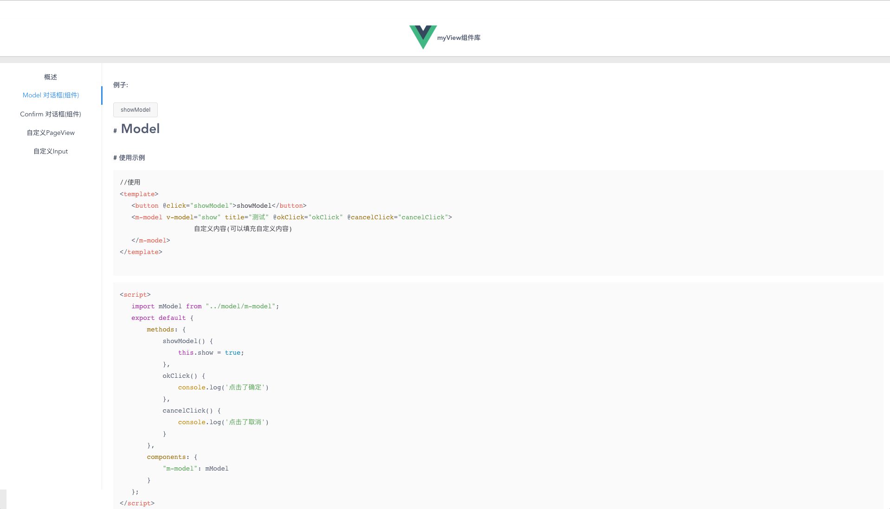

# 关于myView
myView 是我在工作中经常用的Vue组件封装起来的一套UI组件库,主要是用于PC后台界面的开发。
部分组件也可以用在移动端，详情看文档说明。

# 特性
- 使用简单 友好
- 对项目无侵入性
- 可自定义主题
- 易修改源码

# 使用
```shell
git clone "https://github.com/DargonLee/Vue-Componts.git"
cd Vue-Componts 目录
npm install
npm run dev
```
- 组件目录：`src/components/`
- 按需拖入你的项目
- 详情见文档

